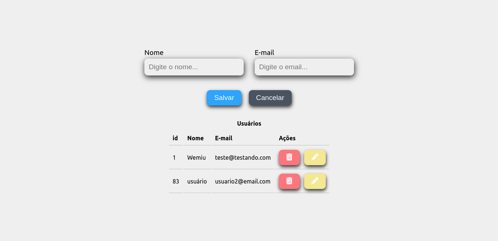

# CRUD - Front-end
:construction: Projeto em construção :construction:

O objetivo é oferecer todas as funcionalidades de um CRUD (Create, Read, Update, Delete), simulando o cadastro de usuários.

# Screenshots
### Tela principal

